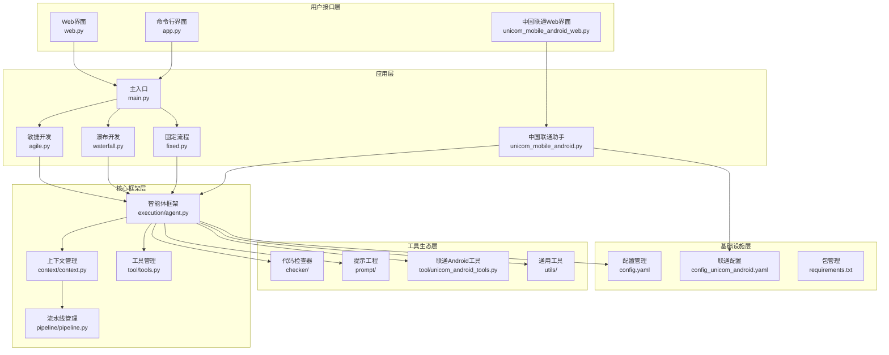
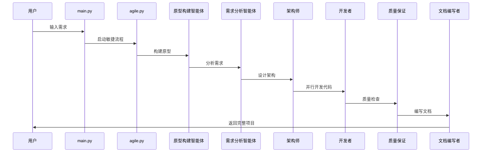
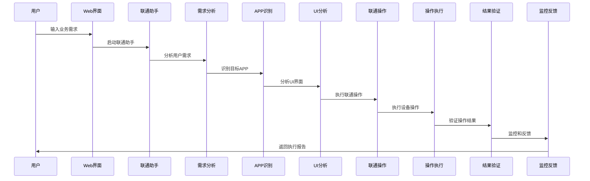

# AgileMind 项目架构详解

## 🏗️ 整体架构概览

AgileMind是一个基于多智能体架构的AI驱动软件开发平台，专门设计为中国联通业务系统提供自动化解决方案。

## 📊 系统架构图



## 🔄 执行流程详解

### 1. 敏捷开发流程 (agile.py)



### 2. 中国联通助手流程 (unicom_mobile_android.py)



## 🧠 核心组件详解

### 1. 智能体框架 (execution/agent.py)

**功能特点:**
- **多轮对话**: 支持智能体间的持续交互
- **工具调用**: 智能体可以调用各种开发工具
- **上下文感知**: 保持对话历史和状态
- **成本跟踪**: 自动计算token使用和成本
- **错误重试**: 自动处理API调用失败

**关键方法:**
```python
def process(context, input_text, max_iterations=None):
    """处理智能体任务的核心方法"""
    # 1. 准备消息
    # 2. 调用LLM API
    # 3. 处理工具调用
    # 4. 更新上下文
    # 5. 返回结果
```

### 2. 上下文管理 (context/context.py)

**核心功能:**
- **状态管理**: 跟踪整个开发过程的状态
- **消息队列**: 智能体间异步通信
- **Token统计**: 详细的token使用分析
- **成本计算**: 实时成本跟踪
- **历史记录**: 完整的执行历史

**数据结构:**
```python
class Context:
    root_dir: str                 # 项目根目录
    raw_demand: str              # 原始需求
    document: Dict[str, str]     # 文档集合
    history: List[Dict]          # 执行历史
    token_usage: TokenUsage      # Token使用统计
    cost: Cost                   # 成本统计
    message_queue: MessageQueue  # 消息队列
```

### 3. 敏捷开发智能体生态

#### 原型构建智能体 (prototype_builder)
- **职责**: 根据需求快速构建HTML原型
- **工具**: write_file
- **输出**: docs/prototype.html

#### 需求分析智能体 (demand_analyst)
- **职责**: 深度分析用户需求
- **工具**: write_file
- **输出**: docs/demand_analysis.md

#### 架构师 (architect)
- **职责**: 设计系统架构和文件结构
- **工具**: write_file
- **输出**: logs/architecture.json, docs/architecture.md

#### 开发者 (developer)
- **职责**: 并行实现代码文件
- **工具**: write_file, add_to_requirements
- **特点**: 支持多线程并行开发

#### 监督智能体 (supervisor)
- **职责**: 代码审查和质量监督
- **工具**: work_done
- **特点**: 可以将任务转交给开发者修改

#### 调试工程师 (debugging_engineer)
- **职责**: 修复代码问题和bug
- **工具**: get_code_structure, read_file, write_file, add_to_requirements
- **特点**: 专注于问题诊断和修复

#### 质量保证 (qa)
- **职责**: 全面的代码质量检查
- **工具**: run_static_analysis, get_code_structure, read_file, work_done
- **特点**: 多轮检查，可转交调试工程师

#### 文档编写者 (document_writer)
- **职责**: 生成项目文档
- **工具**: list_project_structure, get_code_structure, read_file, write_file
- **特点**: 多轮对话完善文档

### 4. 中国联通专用智能体

#### 需求分析智能体 (demand_analyzer)
- **职责**: 分析联通业务需求
- **工具**: 联通设备连接和屏幕获取

#### APP识别智能体 (app_identifier)
- **职责**: 识别和启动联通APP
- **工具**: 应用启动和状态检查

#### UI界面分析智能体 (ui_analyzer)
- **职责**: 分析联通APP界面
- **工具**: 屏幕内容获取和元素查找

#### 联通操作智能体 (unicom_operator)
- **职责**: 执行联通业务操作
- **工具**: 元素点击、文本输入、业务操作

#### 操作执行智能体 (operation_executor)
- **职责**: 执行具体的设备操作
- **工具**: 设备交互和应用管理

#### 结果验证智能体 (result_validator)
- **职责**: 验证操作结果
- **工具**: 界面内容获取和验证

#### 监控反馈智能体 (monitor_feedback)
- **职责**: 生成执行报告
- **工具**: 屏幕内容监控

## 🛠️ 工具生态系统

### 1. 代码检查器 (checker/)

#### 静态检查 (static_checking.py)
- **Python检查器**: 语法、导入、属性、Pylint检查
- **Web检查器**: HTML、CSS、JavaScript验证
- **检查流水线**: 统一的检查接口

#### 检查器种类
- **syntax_checker.py**: Python语法检查
- **import_checker.py**: 导入语句验证  
- **attribute_checker.py**: 属性使用检查
- **pylint_checker.py**: Pylint代码质量检查
- **html_validator.py**: HTML结构验证
- **css_validator.py**: CSS样式检查
- **js_validator.py**: JavaScript语法检查

### 2. 工具管理 (tool/)

#### 核心工具类 (tools.py)
- **文件操作**: write_file, read_file, list_project_structure
- **代码分析**: get_code_structure, run_static_analysis
- **项目管理**: add_to_requirements, work_done

#### 联通Android工具 (unicom_android_tools.py)
- **设备连接**: Android设备连接管理
- **应用操作**: APP启动、关闭、状态检查
- **界面交互**: 元素查找、点击、文本输入
- **屏幕操作**: 截图、内容获取、OCR识别

#### 工具装饰器 (tool_decorator.py)
- **工具注册**: 自动工具发现和注册
- **参数验证**: 工具调用参数检查
- **错误处理**: 统一的错误处理机制

### 3. 提示工程 (prompt/)

#### 敏捷开发提示 (agile.py)
- **智能体提示**: 每个智能体的专用提示词
- **模板系统**: 动态内容填充的模板

#### 联通业务提示 (unicom_mobile.py)
- **业务理解**: 联通业务流程理解
- **操作指导**: 设备操作指导语
- **安全规范**: 操作安全要求

### 4. 实用工具 (utils/)

#### 核心功能模块
- **config_loader.py**: 配置文件加载
- **file.py**: 文件操作辅助
- **window.py**: 日志窗口管理
- **cost.py**: 成本计算
- **retry.py**: 重试机制
- **model_info.py**: 模型信息管理
- **json_cleaner.py**: JSON数据清理
- **code_framework_extractor.py**: 代码框架提取

## 📋 配置管理

### 1. 主配置文件 (config.yaml)
- **LLM配置**: API密钥、基础URL、模型选择
- **智能体配置**: 每个智能体的专用配置
- **工具配置**: 工具的参数设置

### 2. 联通专用配置 (config_unicom_android.yaml)  
- **设备连接**: Android设备连接参数
- **应用配置**: 联通APP的配置信息
- **操作参数**: 设备操作的超时和重试设置

## 🔧 部署和运行

### 1. 环境要求
```bash
# Python 3.8+
pip install -r requirements.txt

# 环境变量设置
export OPENAI_API_KEY="your-api-key"
export OPENAI_BASE_URL="https://api.openai.com/v1"  # 可选
```

### 2. 运行方式

#### 通用软件开发
```bash
# Web界面
streamlit run web.py

# 命令行
python app.py "Create a 2048 game" -o output

# 程序化调用
from agilemind.agile import dev
result = dev(demand="Create a web app", output="./output")
```

#### 中国联通助手
```bash
# Web界面
streamlit run unicom_mobile_android_web.py

# 程序化调用
from agilemind.unicom_mobile_android import unicom_mobile_android_assistant
result = unicom_mobile_android_assistant("查询话费余额", "device_id")
```

## 📈 性能优化特性

### 1. 并行处理
- **多线程开发**: 代码文件并行实现
- **智能体协作**: 异步消息传递
- **工具并发**: 支持并发工具调用

### 2. 成本控制
- **Token跟踪**: 详细的token使用统计
- **成本计算**: 实时成本监控
- **模型选择**: 支持不同成本的模型

### 3. 错误恢复
- **自动重试**: API调用失败自动重试
- **状态恢复**: 从中断点继续执行
- **错误隔离**: 单个智能体错误不影响整体流程

## 🔒 安全特性

### 1. 联通业务安全
- **支付保护**: 遇到支付页面自动停止
- **权限控制**: 严格的操作权限管理
- **数据保护**: 敏感信息加密存储

### 2. 系统安全
- **输入验证**: 严格的用户输入验证
- **沙盒执行**: 代码在隔离环境中执行
- **审计日志**: 完整的操作审计追踪

## 📊 监控和分析

### 1. 执行监控
- **实时状态**: 实时显示执行进度
- **性能指标**: Token使用、成本、耗时统计
- **错误追踪**: 详细的错误信息和堆栈

### 2. 业务分析
- **操作成功率**: 联通业务操作成功率统计
- **用户行为**: 用户操作模式分析
- **系统性能**: 系统响应时间和资源使用

## 🚀 未来扩展

### 1. 技术扩展
- **更多LLM支持**: 支持更多的语言模型
- **移动端支持**: iOS设备操作支持
- **云原生部署**: Docker和Kubernetes支持

### 2. 业务扩展
- **更多运营商**: 支持中国电信等其他运营商
- **更多业务**: 支持更复杂的业务流程
- **AI能力增强**: 集成更多AI能力

---

## 总结

AgileMind是一个功能完整、架构清晰的多智能体软件开发平台。它不仅能够自动化生成高质量的软件项目，还专门为中国联通业务系统提供了完整的自动化解决方案。通过模块化设计和智能体协作，AgileMind实现了高效、安全、可扩展的AI驱动开发流程。

