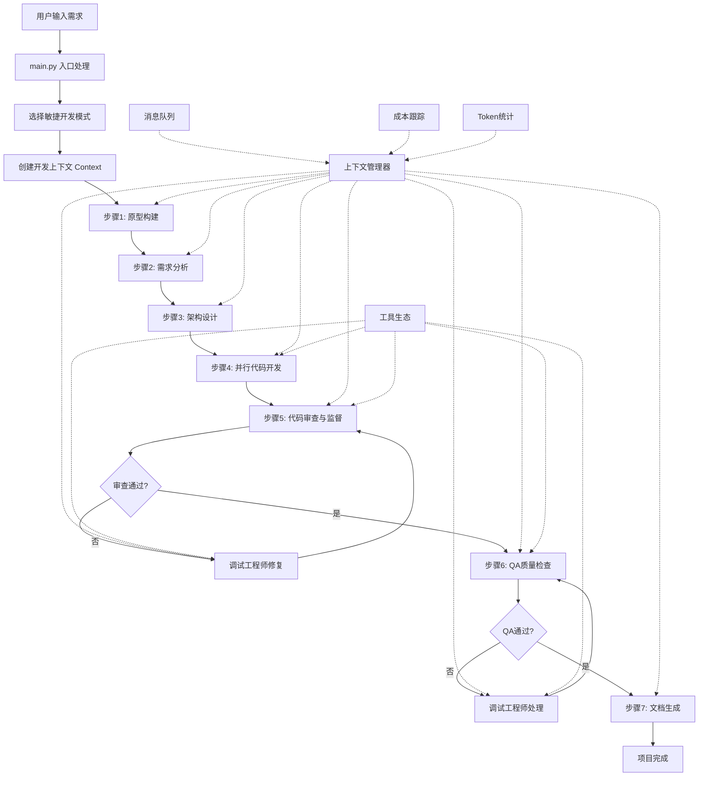
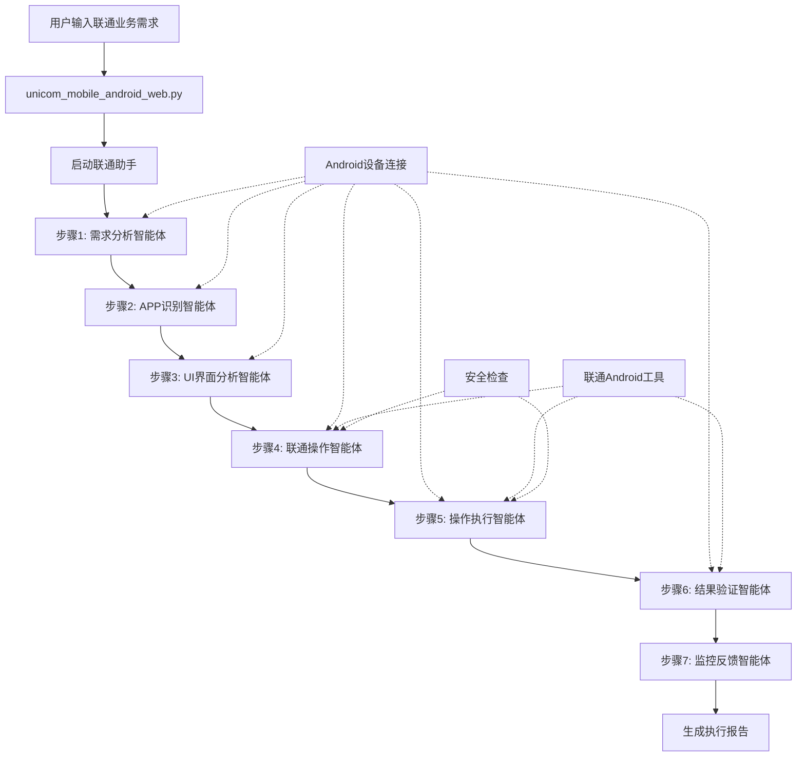

# AgileMind 执行流程详细指南

## 🔄 核心执行流程

### 1. 敏捷开发完整流程



### 2. 中国联通助手执行流程



## 📋 详细步骤说明

### 敏捷开发流程详解

#### 步骤1: 原型构建 (build_prototype)
**智能体**: `prototype_builder`
**功能**: 根据用户需求快速构建HTML原型
**执行逻辑**:
```python
def build_prototype(context, window, demand, file=None, max_iterations=5, interactive=True):
    # 1. 调用原型构建智能体
    prototype_builder.process(context, demand, max_iterations, file=file)
    
    # 2. 检查原型文件是否生成
    if not os.path.isfile("docs/prototype.html"):
        raise FileNotFoundError("Prototype file not found")
    
    # 3. 如果是交互模式，收集用户反馈
    if interactive:
        # 显示原型并收集反馈
        client_satisfied = False
        while not client_satisfied and revision_count < max_iterations:
            # 用户反馈循环
            pass
    
    # 4. 返回最终原型和反馈
    return feedback, prototype
```

**输出**: `docs/prototype.html` - 可交互的HTML原型

#### 步骤2: 需求分析 (analyze_demand)
**智能体**: `demand_analyst`
**功能**: 深度分析用户需求和原型反馈
**执行逻辑**:
```python
def analyze_demand(context, window, demand, feedback, prototype, file=None, max_iterations=5):
    # 1. 构建分析输入
    demand_info = DEMAND_ANALYSIS_TEMPLATE.format(
        raw_demand=demand, 
        feedback=feedback, 
        prototype=prototype
    )
    
    # 2. 调用需求分析智能体
    demand_analyst.process(context, demand_info, max_iterations, file=file)
    
    # 3. 验证分析文档生成
    if not os.path.isfile("docs/demand_analysis.md"):
        raise RuntimeError("Demand analysis failed")
    
    # 4. 返回分析结果
    return demand_analysis
```

**输出**: `docs/demand_analysis.md` - 详细的需求分析文档

#### 步骤3: 架构设计 (build_architecture)
**智能体**: `architect`
**功能**: 设计系统架构和文件结构
**执行逻辑**:
```python
def build_architecture(context, window, demand_analysis, max_iterations=5):
    # 1. 调用架构师智能体
    architect.process(context, demand_analysis, max_iterations)
    
    # 2. 验证架构文件
    if not os.path.isfile("logs/architecture.json"):
        raise RuntimeError("Architecture building failed")
    
    # 3. 解析架构信息
    with open("logs/architecture.json", "r") as f:
        architecture_json = f.read()
    json_info = extract_json(architecture_json)
    
    # 4. 生成文件结构树
    code_file_list = json_info.get("code_file_list", [])
    
    # 5. 生成Markdown架构文档
    architecture_md = convert_json_to_markdown(
        "introduction", "code_file_list", "class_structure", 
        "call_flow", "state_diagram",
        data=json_info, title="Software System Design"
    )
    
    # 6. 保存架构文档
    with open("docs/architecture.md", "w") as f:
        f.write(architecture_md)
    
    return code_file_list, architecture_json
```

**输出**: 
- `logs/architecture.json` - JSON格式的架构信息
- `docs/architecture.md` - 可读的架构文档

#### 步骤4: 并行代码开发 (implement_code)
**智能体**: `developer` (多线程克隆)
**功能**: 并行实现所有代码文件
**执行逻辑**:
```python
def implement_code(context, window, code_file_list, architecture, max_iterations=5, interactive=True):
    def implement_and_review(architecture, file_path, max_iterations):
        # 1. 创建线程专用开发者智能体
        thread_developer = developer.clone(name_suffix=f"_{os.path.basename(file_path)}")
        
        # 2. 实现代码文件
        thread_developer.process(
            context,
            DEVELOPING_TEMPLATE.format(architecture=architecture, file_path=file_path),
            clear_memory=True
        )
        
        # 3. 代码审查
        supervisor_res = supervisor.process(
            context,
            SUPERVISER_TEMPLATE.format(
                architecture=architecture, 
                file_path=file_path, 
                file_content=code
            ),
        )
        
        # 4. 处理审查结果
        if supervisor_res["reason"] == "handoff":
            # 需要修改，转交开发者
            thread_developer.process(
                context,
                QA_FEEDBACK_TEMPLATE.format(
                    file_path=file_path, 
                    description=supervisor_res["handoff"]["instruction"]
                ),
                clear_memory=False,
            )
    
    # 并行处理所有文件
    if interactive:
        # 使用ThreadPoolExecutor并行执行
        with ThreadPoolExecutor() as executor:
            code_tasks = [
                executor.submit(implement_and_review, architecture, file, max_iterations)
                for file in code_file_list
            ]
            # 等待所有任务完成
            for task in as_completed(code_tasks):
                task.result()
    else:
        # 顺序执行（用于Web界面兼容性）
        for file in code_file_list:
            implement_and_review(architecture, file, max_iterations)
```

**特点**: 
- 支持多线程并行开发
- 每个文件有独立的智能体实例
- 内置代码审查机制

#### 步骤5: QA质量检查 (qa_check)
**智能体**: `qa` 和 `debugging_engineer`
**功能**: 全面的代码质量检查和问题修复
**执行逻辑**:
```python
def qa_check(context, window, code_file_list, architecture, max_iterations=5):
    round_count = 0
    while round_count < max_iterations:
        # 1. QA质量检查
        qa_result = qa.process(
            context,
            QA_CHECKING_TEMPLATE.format(
                architecture=architecture, 
                file_list=code_file_list
            ),
            clear_memory=False,
        )
        
        # 2. 检查结果处理
        if qa_result["reason"] in ["work_done", "completed"]:
            print("Code review completed successfully.")
            break
        
        if qa_result["reason"] == "handoff":
            # 3. 转交调试工程师处理问题
            instruction = qa_result["handoff"]["instruction"]
            debugging_engineer.process(
                context,
                DEBUGGING_TEMPLATE.format(
                    architecture=architecture,
                    description=instruction,
                ),
            )
        
        round_count += 1
```

**特点**: 
- 多轮检查循环
- 自动问题检测和修复
- 静态代码分析集成

#### 步骤6: 文档生成 (draft_documentation)
**智能体**: `document_writer`
**功能**: 生成项目文档
**执行逻辑**:
```python
def draft_documentation(context, window, demand, architecture, max_iterations=5):
    # 调用文档编写智能体
    document_writer.process(
        context,
        DOCUMENT_WRITER_TEMPLATE.format(
            raw_demand=demand, 
            architecture=architecture
        ),
        max_iterations=max_iterations,
    )
```

**输出**: 完整的项目文档，包括README、API文档等

### 中国联通助手流程详解

#### 步骤1: 需求分析 (analyze_user_demand)
**智能体**: 需求分析智能体
**功能**: 分析联通业务需求
**执行逻辑**:
```python
def analyze_user_demand(user_input, device_id):
    # 1. 连接Android设备
    connect_result = unicom_tools.unicom_android_connect(device_id)
    
    # 2. 构建分析提示
    analysis_prompt = f"""
    用户需求: {user_input}
    设备ID: {device_id}
    请分析这个用户需求，识别需要操作的中国联通业务类型，并提供详细的操作计划。
    """
    
    # 3. 调用智能体分析
    result = demand_analyzer.run(analysis_prompt)
    
    return {"success": True, "analysis_result": result}
```

#### 步骤2: APP识别 (identify_target_app)
**智能体**: APP识别智能体
**功能**: 识别和启动目标联通APP
**执行逻辑**:
```python
def identify_target_app(demand_analysis, device_id):
    # 1. 构建识别提示
    app_prompt = f"""
    需求分析结果: {demand_analysis}
    根据需求分析结果，请：
    1. 连接到Android设备
    2. 识别需要使用的中国联通APP
    3. 检查APP是否已安装
    4. 启动目标APP
    5. 验证APP启动状态
    """
    
    # 2. 调用APP识别智能体
    result = app_identifier.run(app_prompt)
    
    return {"success": True, "app_result": result}
```

#### 步骤3: UI界面分析 (analyze_ui_elements)
**智能体**: UI界面分析智能体
**功能**: 分析联通APP的当前界面
**执行逻辑**:
```python
def analyze_ui_elements(app_context):
    # 1. 构建UI分析提示
    ui_prompt = f"""
    APP上下文: {app_context}
    请分析当前中国联通APP的界面：
    1. 获取当前屏幕截图
    2. 进行OCR文本识别
    3. 识别可操作的界面元素
    4. 判断当前页面类型
    5. 提供操作路径建议
    """
    
    # 2. 调用UI分析智能体
    result = ui_analyzer.run(ui_prompt)
    
    return {"success": True, "ui_analysis": result}
```

#### 步骤4-7: 操作执行和验证
类似的模式，每个智能体专注于自己的职责，通过工具调用实现具体功能。

## ⚙️ 智能体协作机制

### 1. 消息传递系统
```python
# 智能体间发送消息
context.enqueue_message(
    target_agent="debugging_engineer",
    message={"content": "代码存在语法错误，需要修复"},
    sender="qa"
)

# 接收消息
messages = context.dequeue_messages("debugging_engineer")
```

### 2. 工具调用机制
```python
# 智能体调用工具
@tool
def write_file(file_path: str, content: str) -> Dict[str, Any]:
    """写入文件工具"""
    try:
        with open(file_path, 'w', encoding='utf-8') as f:
            f.write(content)
        return {"success": True, "file_path": file_path}
    except Exception as e:
        return {"success": False, "error": str(e)}
```

### 3. 上下文共享
```python
# 更新上下文状态
context.update_token_usage(
    prompt_tokens=prompt_tokens,
    completion_tokens=completion_tokens,
    agent_name=agent_name,
    round_number=round_number,
    model=model
)

# 记录执行历史
context.add_history(
    step=agent_name,
    data={
        "input": input_text,
        "output": output_text,
        "tools_used": tools_used
    }
)
```

## 🔧 配置和自定义

### 1. 智能体配置
```yaml
# config.yaml
workflow:
  prototype:
    model: "gpt-4o-mini"
    temperature: 0.7
  
  documentation:
    model: "gpt-4o-mini"
    temperature: 0.3
  
  programming:
    model: "gpt-4o"
    temperature: 0.1
```

### 2. 工具配置
```python
# 注册自定义工具
@tool
def custom_tool(param1: str, param2: int) -> Dict[str, Any]:
    """自定义工具示例"""
    # 工具实现
    return {"result": "success"}

# 将工具添加到智能体
agent = Agent(
    name="custom_agent",
    tools=[get_tool("custom_tool")]
)
```

## 📊 监控和调试

### 1. 执行监控
- **实时日志**: 通过LogWindow显示实时执行状态
- **进度跟踪**: 每个步骤的详细进度信息
- **错误捕获**: 完整的错误堆栈和上下文

### 2. 性能分析
- **Token统计**: 详细的API调用统计
- **成本分析**: 实时成本跟踪和预测
- **时间分析**: 各个步骤的耗时统计

### 3. 调试工具
- **状态检查**: 检查智能体和上下文状态
- **消息追踪**: 查看智能体间的消息传递
- **工具调用日志**: 详细的工具调用记录

## 🚀 最佳实践

### 1. 开发最佳实践
- **需求明确**: 提供详细的需求描述
- **迭代开发**: 合理设置最大迭代次数
- **交互模式**: 在开发过程中提供及时反馈

### 2. 联通业务最佳实践
- **安全第一**: 遇到敏感操作自动停止
- **设备准备**: 确保Android设备连接正常
- **权限配置**: 正确配置应用权限

### 3. 性能优化
- **并行执行**: 充分利用多线程并行开发
- **模型选择**: 根据任务选择合适的模型
- **缓存利用**: 合理利用上下文缓存

---

这个详细的执行流程指南展示了AgileMind如何通过多智能体协作实现复杂的软件开发和业务自动化任务。每个步骤都有明确的职责分工和错误处理机制，确保整个流程的稳定性和可靠性。

