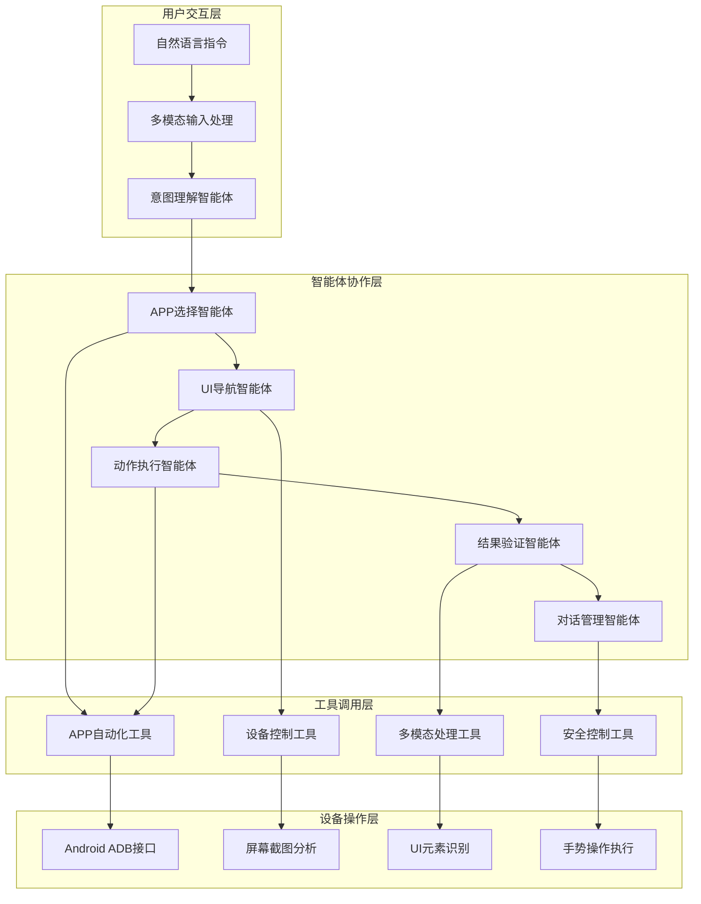

# 🤖 通用型AI助手

> **基于多智能体架构的APP自动化操作系统**  
> 中国联通挑战杯参赛项目

[](https://github.com/wnrock/AgileMind)
[](https://github.com/wnrock/AgileMind)
[](https://github.com/wnrock/AgileMind)
[](https://github.com/wnrock/AgileMind)

## 📝 项目概述

**通用型AI助手**是一个基于多智能体架构的智能手机应用自动化操作系统。该系统能够理解用户的自然语言指令，自动操作各种移动应用程序，完成用户委托的任务。

### 🎯 核心功能

#### 🏢 中国联通专用服务
- **话费查询**: 自动查询账户话费余额
- **流量查询**: 自动查询账户流量余额
- **权益领取**: 自动领取积分权益、优惠券等
- **电话智能代接**: 设置和管理智能代接功能
- **账单管理**: 查询历史账单、设置缴费提醒


## 🏗️ 技术架构

### 多智能体协作系统



### 🧠 智能体详解

#### 1. 意图理解智能体 (Intent Analyzer)
- **职责**: 深度理解用户自然语言指令
- **技术**: 大语言模型 + 语义分析
- **输出**: 结构化的任务意图和参数

#### 2. APP选择智能体 (App Selector)  
- **职责**: 根据任务选择最适合的目标应用
- **技术**: 应用特征匹配 + 智能推荐
- **输出**: 目标应用包名和启动策略

#### 3. UI导航智能体 (UI Navigator)
- **职责**: 分析应用界面，规划操作路径
- **技术**: OCR文字识别 + 界面元素分析
- **输出**: 详细的操作步骤规划

#### 4. 动作执行智能体 (Action Executor)
- **职责**: 执行具体的手势和输入操作
- **技术**: Android ADB + 手势模拟
- **输出**: 操作执行结果和状态

#### 5. 结果验证智能体 (Result Validator)
- **职责**: 验证操作是否达到预期目标
- **技术**: 界面对比 + 结果匹配
- **输出**: 验证报告和改进建议

#### 6. 对话管理智能体 (Conversation Manager)
- **职责**: 管理与用户的友好对话交互
- **技术**: 对话生成 + 情感识别
- **输出**: 用户友好的反馈信息

### 🛠️ 核心技术栈

- **多模态大模型**: OpenAI GPT-4o-mini
- **多智能体框架**: 自研协作框架
- **设备控制**: Android Debug Bridge (ADB)
- **图像处理**: OpenCV + PIL
- **文字识别**: Tesseract OCR
- **语音处理**: SpeechRecognition + pyttsx3
- **Web界面**: Streamlit
- **配置管理**: YAML + 环境变量

## 🚀 快速开始

### 环境要求

- Python 3.8+
- Android设备 (开启USB调试)
- ADB工具 (Android SDK)
- OpenAI API Key

### 安装步骤

1. **克隆项目**
```bash
git clone https://github.com/LittleYoungFish/UniMind.git
cd UniMind
```

2. **安装依赖**
```bash
pip install -r requirements.txt
```

3. **配置环境**
```bash
# 设置API密钥
export OPENAI_API_KEY="your-api-key-here"

# 可选：自定义API端点
export OPENAI_BASE_URL="https://api.openai.com/v1"
```

4. **连接Android设备**
```bash
# 启用USB调试，连接设备
adb devices
```

### 🖥️ 使用方式

#### Web界面 (推荐)
```bash
streamlit run universal_ai_assistant_web.py
```

#### 命令行界面
```bash
# 基本使用
python app.py "帮我查询联通话费余额"

# 指定设备
python app.py "帮我领取权益" --device-id emulator-5554

# 交互式模式  
python app.py --interactive

# 查看帮助
python app.py --help
```

#### 中国联通专用界面
```bash
streamlit run unicom_mobile_android_web.py
```

### 📱 使用示例

#### 联通电信服务
```bash
# 查询话费
python app.py "帮我查询当前话费余额"

# 权益领取
python app.py "帮我领取联通会员权益"
```

## 🎯 中国联通专用功能

### 支持的联通APP
- 📱 **中国联通手机营业厅**: 主营业厅应用
- 💰 **沃钱包**: 支付和金融服务  
- 🎬 **沃视频**: 视频娱乐服务
- 📚 **沃阅读**: 数字阅读服务
- 🎵 **沃音乐**: 音乐娱乐服务
- ☁️ **沃云**: 云存储服务

### 智能代接功能
```python
# 设置智能代接
assistant.process("设置电话智能代接，工作时间自动接听")

# 管理代接规则  
assistant.process("修改代接设置，只有重要联系人才转接")
```

### 权益自动领取
```python
# 批量领取权益
assistant.process("检查并领取所有可用的联通权益")

# 定时权益提醒
assistant.process("设置每周提醒我查看新权益")
```

## 🔒 安全特性

### 隐私保护
- ❌ **不收集**: 不收集用户个人信息
- 🔒 **本地处理**: 设备操作在本地执行
- 🛡️ **数据加密**: 敏感数据本地加密存储
- 👁️ **操作透明**: 所有操作步骤可追踪

### 安全控制
- 🚫 **支付保护**: 遇到支付页面自动停止
- ⏰ **操作限制**: 限制单次操作时间和频率  
- 🔐 **权限管理**: 严格的设备权限控制
- 📝 **操作日志**: 完整的操作审计日志

## 📊 项目结构

```
AgileMind/
├── agilemind/                          # 核心框架
│   ├── universal_ai_assistant.py       # 通用AI助手主类
│   ├── execution/                      # 智能体执行框架
│   │   ├── agent.py                   # 智能体基类
│   │   └── config.py                  # 执行配置
│   ├── tool/                          # 工具集合
│   │   ├── app_automation_tools.py    # APP自动化工具
│   │   └── unicom_android_tools.py    # 联通专用工具
│   ├── prompt/                        # 提示词工程
│   │   ├── universal_assistant_prompts.py  # 智能体提示词
│   │   └── unicom_mobile.py          # 联通专用提示词
│   ├── context/                       # 上下文管理
│   │   ├── context.py                 # 上下文类
│   │   ├── token_usage.py            # Token统计
│   │   └── cost.py                   # 成本计算
│   └── utils/                        # 工具函数
├── universal_ai_assistant_web.py      # 通用AI助手Web界面
├── unicom_mobile_android_web.py       # 联通专用Web界面  
├── config_unicom_android.yaml         # 联通配置文件
├── requirements.txt                   # 依赖清单
└── README.md                         # 项目说明
```

## 🔧 配置说明

### 基本配置 (config_unicom_android.yaml)
```yaml
# Android设备配置
android_connection:
  device_id: ""  # 设备序列号
  adb_path: "adb"
  connection_timeout: 30

# 智能体配置
workflow:
  agents:
    intent_analyzer:
      model: "gpt-4o-mini"
      temperature: 0.3
    app_selector:
      model: "gpt-4o-mini"  
      temperature: 0.2
    # ... 其他智能体配置
```

### 环境变量
```bash
# 必需
OPENAI_API_KEY=your-api-key

# 可选
OPENAI_BASE_URL=https://api.openai.com/v1
ANDROID_DEVICE_ID=device-serial-number
```

## 📈 性能特性

- ⚡ **并发处理**: 智能体并发协作，提升效率
- 🧠 **智能缓存**: 缓存常用操作，减少重复计算  
- 🔄 **自动重试**: 操作失败自动重试机制
- 📊 **实时监控**: 实时监控系统状态和性能

## 🤝 贡献指南

1. Fork 本仓库
2. 创建功能分支 (`git checkout -b feature/AmazingFeature`)
3. 提交更改 (`git commit -m 'Add some AmazingFeature'`)
4. 推送到分支 (`git push origin feature/AmazingFeature`)
5. 创建 Pull Request

## 📄 许可证

本项目基于 MIT 许可证开源 - 查看 [LICENSE](LICENSE) 文件了解详情。

## 🎉 致谢

- **中国联通**: 提供比赛平台和技术支持
- **OpenAI**: 提供强大的大语言模型API
- **Android团队**: 提供ADB调试工具
- **开源社区**: 提供丰富的开源工具和库

## 📞 联系我们

- **项目主页**: [https://github.com/LittleYoungFish/UniMind](https://github.com/LittleYoungFish/UniMind)
- **问题反馈**: [GitHub Issues](https://github.com/wnrock/AgileMind/issues)
- **技术交流**: 欢迎提交PR和Issue

---

<div align="center">

**🏆 中国联通挑战杯参赛作品**

*基于多智能体架构的通用型AI助手技术研究*

</div>